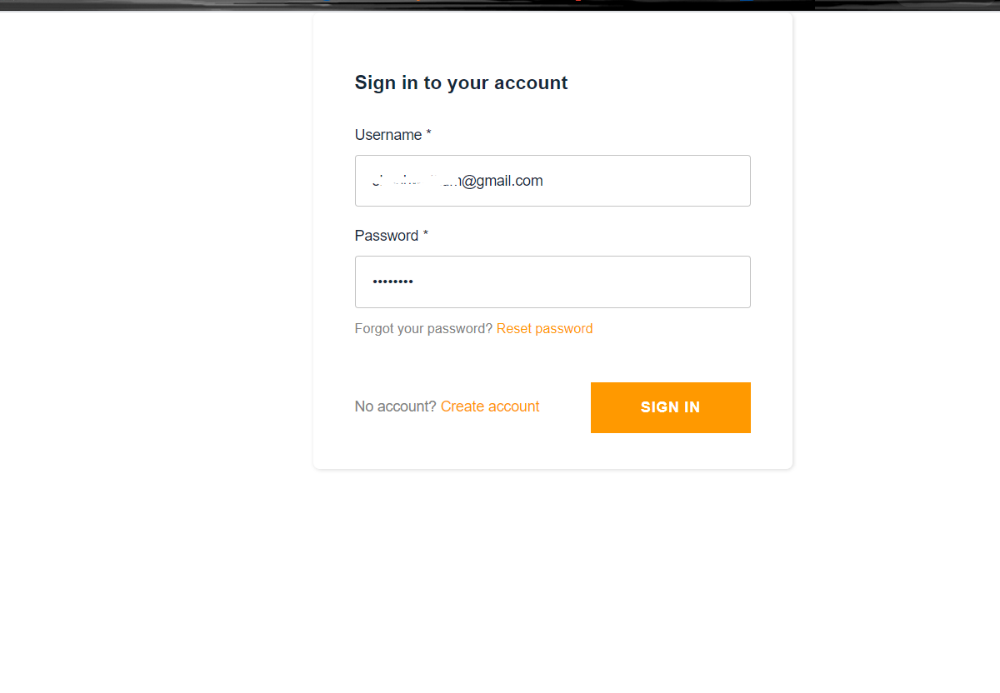
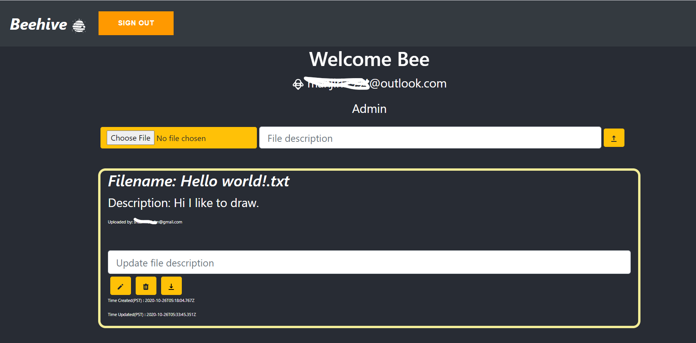

This project was bootstrapped with [Create React App](https://github.com/facebook/create-react-app).

## Project Name:  Beehive (Cloud File Storage using S3 bucket.)
### Project 1- CMPE 281
#### Created By: Manjiri Kadam

#### Objective:
To Create a highly available, highly scalable, cost effective 3 tier web application which would be accessible over public internet through your registered domain name.

#### Webpage link: https://beehive.manjirikdm.com/

## Introduction:

Beehive is a webapp, which is hosted on AWS Amplify has a serverless architecture which is highly scalable and highly available. I have written the code in JavaScript, HTML, and CSS using React.js framework. Written code using VScode, tracked my journey on Github.
In this app, user can login via user authentication, I used AWS Cognito for this. When user gets entered in the app, he/she will be able to upload, download the files which are smaller than 10MB. 
It provides secured way of storing the files in S3 bucket. I have used DynamoDB to store metadata of file upload.
I have covered all the basic functionality which is mentioned in project objective. I have implemented CRUD operation to call API’s to access S3 storage. User will be able to save their files using this app, they can download them, modify the description of file also cam delete them.
I have displayed user’s information on top of the app. The app records the time file got uploaded, and updated. 
I have created “Admin” page to monitor all users data. 
I have made this application serverless, deployed it on AWS Amplify, using github for deployment. 
It leverages various technologies like – Route 53 for personalized domain name, S3- CloudFront, Cloudwatch, SNS (Simple Notification Service).
I have created the backend architecture very powerful so as to it will be  highly available.(All DR measures are taken care of).

Attached some snippets from my webapp:

#### User Sign in:

User can signup to my webapp here. I have used AWS Cognito for the authentication.

#### Webpage - When user is logged in:

User can see his/her email address on top of the application. He/she can upload the files, see the uploaded files, download and delete the files. Also, user can edit the decription of file.

#### Webpage - Admin page:

Admin can access other users files.

## Available Scripts

In the project directory, you can run:

### `yarn start`

Runs the app in the development mode. 
Open [http://localhost:3000](http://localhost:3000) to view it in the browser.

The page will reload if you make edits. 
You will also see any lint errors in the console.

### `yarn test`

Launches the test runner in the interactive watch mode. 
See the section about [running tests](https://facebook.github.io/create-react-app/docs/running-tests) for more information.

### `yarn build`

Builds the app for production to the `build` folder. 
It correctly bundles React in production mode and optimizes the build for the best performance.

The build is minified and the filenames include the hashes. 
Your app is ready to be deployed!

See the section about [deployment](https://facebook.github.io/create-react-app/docs/deployment) for more information.

### `yarn eject`

**Note: this is a one-way operation. Once you `eject`, you can’t go back!**

If you aren’t satisfied with the build tool and configuration choices, you can `eject` at any time. This command will remove the single build dependency from your project.

Instead, it will copy all the configuration files and the transitive dependencies (webpack, Babel, ESLint, etc) right into your project so you have full control over them. All of the commands except `eject` will still work, but they will point to the copied scripts so you can tweak them. At this point you’re on your own.

You don’t have to ever use `eject`. The curated feature set is suitable for small and middle deployments, and you shouldn’t feel obligated to use this feature. However we understand that this tool wouldn’t be useful if you couldn’t customize it when you are ready for it.

## Learn More

You can learn more in the [Create React App documentation](https://facebook.github.io/create-react-app/docs/getting-started).

To learn React, check out the [React documentation](https://reactjs.org/).

### Code Splitting

This section has moved here: https://facebook.github.io/create-react-app/docs/code-splitting

### Analyzing the Bundle Size

This section has moved here: https://facebook.github.io/create-react-app/docs/analyzing-the-bundle-size

### Making a Progressive Web App

This section has moved here: https://facebook.github.io/create-react-app/docs/making-a-progressive-web-app

### Advanced Configuration

This section has moved here: https://facebook.github.io/create-react-app/docs/advanced-configuration

### Deployment

This section has moved here: https://facebook.github.io/create-react-app/docs/deployment

### `yarn build` fails to minify

This section has moved here: https://facebook.github.io/create-react-app/docs/troubleshooting#npm-run-build-fails-to-minify

